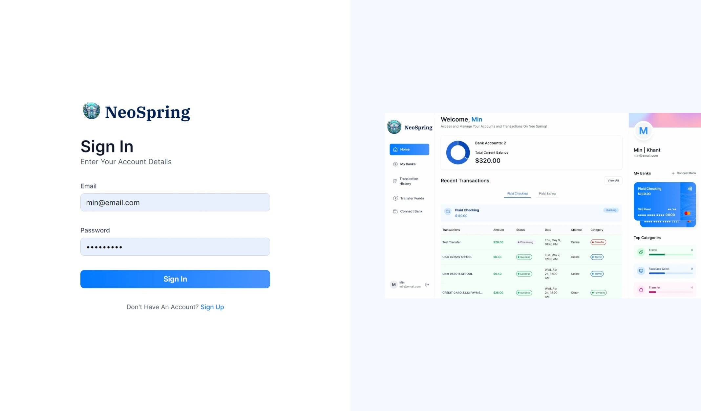
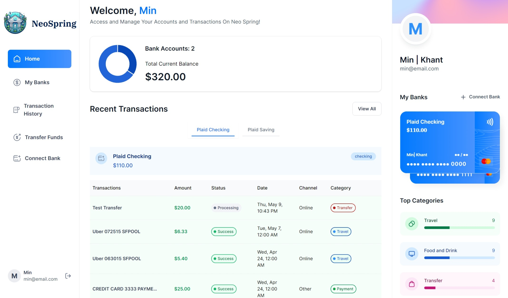
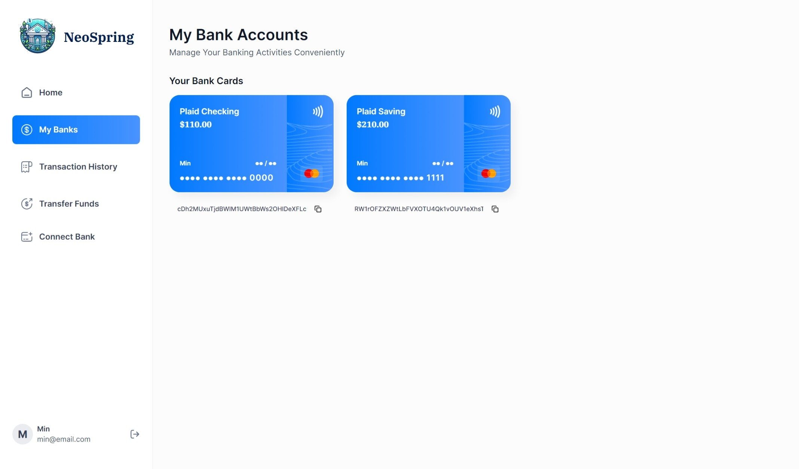
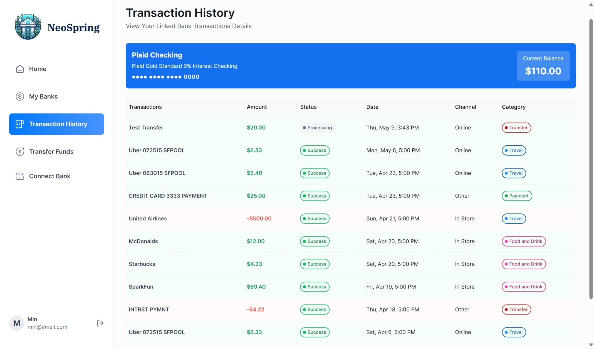
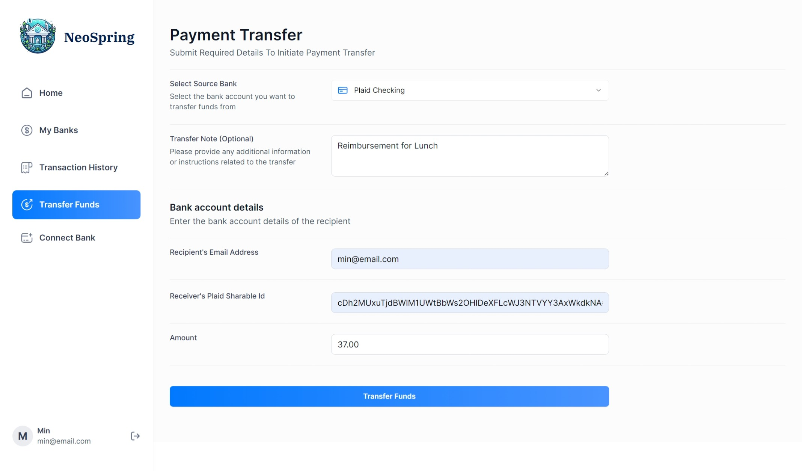

# **Neo Spring Banking** 
## **Nextjs.14 Financial SaaS Platform**

## 📝 Overview
**Neo Spring Banking** is a cutting-edge financial Software as a Service (SaaS) platform that revolutionizes the way users interact with their finances. Built on the robust foundation of **Next.js14**, it offers a comprehensive suite of features that cater to the digital age, connecting multiple bank accounts, displaying transactions in real-time, and facilitating seamless money transfers.

## 📋 <a name="table">Table of Contents</a>

1. 🌐 [Demo](#demo)
2. ✨ [Features](#features)
3. 🚀 [Tech-Stacks](#tech-stacks)
4. 🛠️ [Installations](#installations)
5. 📖 [License](#license)
6. 🙏 [Acknowledgement](#acknowledgement)


 
 
 
 



## 🌐 Demo
Deployed URL: [https://neo-spring-banking.vercel.app/]


## ✨ Features

- **Authentication**: Ultra-secure SSR authentication with robust validations and authorization.
- **Connect Banks**: Seamless integration with Plaid for linking multiple bank accounts.
- **Home Page**: A dashboard that provides a general overview of the user's financial health, including total balance, recent transactions, and spending categories.
- **My Banks**: A comprehensive list of all connected banks, complete with balances and detailed account information.
- **Transaction History**: Advanced features like pagination and filtering to sift through transaction history across different banks.
- **Real-time Updates**: Immediate reflection of changes on all relevant pages when new bank accounts are connected.
- **Funds Transfer**: User-friendly interface to transfer funds using Dwolla, complete with necessary fields and recipient bank ID.
- **Responsiveness**: A design that adapts flawlessly to different screen sizes and devices, ensuring a consistent experience from desktop to mobile.


## 🚀 Tech-Stacks

The project is built using the following technologies:

- **Next.js**: The React framework for production.
- **TypeScript**: Ensuring type safety across the application.
- **Appwrite**: Backend server that simplifies development.
- **Plaid**: Connects users to their bank accounts securely.
- **Dwolla**: Powers efficient fund transfers.
- **React Hook Form**: Manages forms with ease.
- **Zod**: Offers TypeScript-first schema validation.
- **TailwindCSS**: For a utility-first approach to styling.
- **Chart.js**: Visualizes data with interactive charts.
- **ShadCN**: A custom component library for UI consistency.


## 🛠️ Installation

To run the app locally, follow these steps:

Clone the repository: git clone https://github.com/<your-username>/image-transformer.git
Install the dependencies: npm install
Create a .env.local file in the root directory and add the following environment variables:

```
#NEXT
NEXT_PUBLIC_SITE_URL=

#APPWRITE
NEXT_PUBLIC_APPWRITE_ENDPOINT=https://cloud.appwrite.io/v1
NEXT_PUBLIC_APPWRITE_PROJECT=
APPWRITE_DATABASE_ID=
APPWRITE_USER_COLLECTION_ID=
APPWRITE_BANK_COLLECTION_ID=
APPWRITE_TRANSACTION_COLLECTION_ID=
APPWRITE_SECRET=

#PLAID
PLAID_CLIENT_ID=
PLAID_SECRET=
PLAID_ENV=
PLAID_PRODUCTS=
PLAID_COUNTRY_CODES=

#DWOLLA
DWOLLA_KEY=
DWOLLA_SECRET=
DWOLLA_BASE_URL=https://api-sandbox.dwolla.com
DWOLLA_ENV=sandbox

```
Run the development server: npm run dev

Open http://localhost:3000 with your browser to see the result.


## Usage

To use this project, you need to sign up or log in with your email and personal information securely.


## 📖 License

Neo Spring Banking is open source and licensed under the MIT license. You can find the code base and the README file on GitHub. I welcome any feedback, suggestions, or contributions to improve the project and make it more useful for the community.

## Feedback

If you have any feedback, suggestions, or questions, feel free to contact me at min@mandalaymorningstar.com or open an issue on GitHub. I would love to hear from you and improve the project. Thank you for using and supporting the web app.

## 🙏 Acknowledgements

This project is inspired by JS Mastery and the Burmese Spring Revolution Civil Disobedience Movement. The project aims to support the cause of democracy and human rights in Myanmar through cutting-edge web development tech stacks.

GitHub: https://github.com/min-hinthar 
Email: min@mandalaymorningstar.com 
LinkedIn: https://www.linkedin.com/in/minkkhant93/ 
Portfolio: https://minkkhant-portfolio.netlify.app/ 